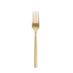
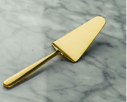

import { FontAwesomeIcon } from "@fortawesome/react-fontawesome"
import { faLevelUpAlt } from "@fortawesome/free-solid-svg-icons"
import { faLevelDownAlt } from "@fortawesome/free-solid-svg-icons"

## Preamble

Amarillo Fact of the Week: The settlement originally was called Oneida; it later changed its name to Amarillo, which derives from yellow wildflowers that were plentiful during the spring and summer or the nearby Amarillo Lake and Amarillo Creek, named in turn for the yellow soil along their banks and shores.

And with that, the most yellow of Power Rankings one could be thankful for. In honor of the upcoming Thanksgiving Holiday, I share with you Andrew’s Thanksgiving Golden Utensil Power Rankings.

## <FontAwesomeIcon className="levelUp" icon={faLevelUpAlt} />  Saquon deez nuts | 8-2W/L | 1007PF

### Week Ten Points: 93.64

#### Golden Serving Fork

The most elite of the Thanksgiving utensils. The golden serving fork is reserved for the finest oven golden turkey. It has multiple very strong and dagger like teeth, perfect for injecting itself into the prey that would be that nice roasted bird. There is nothing this utensil cannot do. That is my team...

| Name                  | Team   | Depth |
| --------------------- | ------ | ----- |
| Geno Smith            | SEA-QB | 1     |
| Clyde Edwards-Helaire | KC-RB  | 1     |
| Saquon Barkley        | NYG-RB | 1     |
| Mike Evans            | TB-WR  | 1     |
| Adam Thielen          | MIN-WR | 1     |
| Zach Ertz             | ARI-TE | 1     |
| DK Metcalf            | SEA-WR | 1     |
| Devin Singletary      | BUF-RB | 1     |
| San Francisco 49ers   | SF-DEF |       |

## <FontAwesomeIcon className="levelUp" icon={faLevelUpAlt} />  Dragonball Zeke | 7-3W/L | 1194PF

### Week Ten Points: 107.95

#### Golden Knife

Oh, the golden knife, how it perfectly sits in one’s hand to slice the perfect load of bread or to cut through a delicious butter biscuit. That is Scottie’s team, it has so many teeth you aren’t sure which one is going to cut you from week to week. You should be afraid of this utensil as in the wrong hands it could kill you.

| Name              | Team   | Depth |
| ----------------- | ------ | ----- |
| Josh Allen        | BUF-QB | 1     |
| Nick Chubb        | CLE-RB | 1     |
| Kenneth Walker    | SEA-RB | 2     |
| Justin Jefferson  | MIN-WR | 1     |
| Diontae Johnson   | PIT-WR | 1     |
| T.J. Hockenson    | DET-TE | 1 (Q) |
| Darrell Henderson | LAR-RB | 1     |
| Deebo Samuel      | SF-WR  | 1     |
| Las Vegas Raiders | LV-DEF |       |

## <FontAwesomeIcon className="levelUp" icon={faLevelUpAlt} />  Fullmetal Ekelerist | 7-3W/L | 1093PF

### Week Ten Points: 121.03

#### Golden Salad Tongs

The golden salad tongs, many undervalue this utensil. Fear not though as this utensil while may not be able to carry the heaviest weight of Thanksgiving food I assure you it carries the largest volume. This was Callen’s team for most of the year, with some recent injuries we will see if one of the sides of the tong becomes slotted and starts to leak.

| Name             | Team    | Depth |
| ---------------- | ------- | ----- |
| Justin Herbert   | LAC-QB  | 1     |
| David Montgomery | CHI-RB  | 1 (Q) |
| D'Onta Foreman   | CAR-RB  | 2     |
| CeeDee Lamb      | DAL-WR  | 1     |
| Allen Lazard     | GB-WR   | 1 (Q) |
| Gerald Everett   | LAC-TE  | 1     |
| Aaron Jones      | GB-RB   | 1     |
| Austin Ekeler    | LAC-RB  | 1     |
| Tennessee Titans | TEN-DEF |       |

## <FontAwesomeIcon className="levelUp" icon={faLevelUpAlt} />  Unaccredited Chili Guy | 3-7W/L | 1122PF

### Week Ten Points: 89.43

#### Golden Slotted Spoon

Oh Trond, Trond, Trond, Trond. You sir are the golden slotted spoon. While arguably an important utensil, as with the liquid in any Thanksgiving side dish wins seem to just fall through the cracks with you and your team. You just have to hope that the rest of the points your spoon holds can take you to the Cathy.

| Name                  | Team    | Depth |
| --------------------- | ------- | ----- |
| Patrick Mahomes       | KC-QB   | 1     |
| Cordarrelle Patterson | ATL-RB  | 1     |
| Miles Sanders         | PHI-RB  | 1     |
| Davante Adams         | LV-WR   | 1     |
| Tyreek Hill           | MIA-WR  | 1     |
| George Kittle         | SF-TE   | 1     |
| Amari Cooper          | CLE-WR  | 1     |
| Pat Freiermuth        | PIT-TE  | 1     |
| Los Angeles Rams      | LAR-DEF |       |

## <FontAwesomeIcon className="levelUp" icon={faLevelUpAlt} />  Jalen the Super Saiyan | 6-4W/L | 988PF

### Week Ten Points: 96.75

#### Golden Meat Fork

Similar to the all-mighty severing fork, the golden meat fork is quite the Thanksgiving utensil. The only down side is it really only has 2 points. That is Travis’ team, he only has 2 players that are really worth anything.

| Name                | Team    | Depth |
| ------------------- | ------- | ----- |
| Jalen Hurts         | PHI-QB  | 1     |
| Dalvin Cook         | MIN-RB  | 1     |
| D'Andre Swift       | DET-RB  | 1 (D) |
| JuJu Smith-Schuster | KC-WR   | 1     |
| Michael Pittman     | IND-WR  | 1     |
| Dalton Schultz      | DAL-TE  | 1 (Q) |
| Joshua Palmer       | LAC-WR  | 1     |
| Najee Harris        | PIT-RB  | 1     |
| Dallas Cowboys      | DAL-DEF |       |

## <FontAwesomeIcon className="levelUp" icon={faLevelUpAlt} />  My Hero Alvin Kamaria | 6-4W/L | 1066PF

### Week Ten Points: 99.77

#### Golden Spoon

If you know anything about Thanksgiving feasts you know spoons are hit or miss. If the chef prepared soup or a casserole it may get more love than other times. This also applies to Logan’s team, he has potential to be feared by many.

| Name                 | Team   | Depth |
| -------------------- | ------ | ----- |
| Daniel Jones         | NYG-QB | 1     |
| Alvin Kamara         | NO-RB  | 1 (Q) |
| Brian Robinson       | WAS-RB |       |
| A.J. Brown           | PHI-WR | 1     |
| Gabe Davis           | BUF-WR | 1 (Q) |
| Dallas Goedert       | PHI-TE | 1     |
| Brandon Aiyuk        | SF-WR  | 1     |
| Terry McLaurin       | WAS-WR | 1     |
| Tampa Bay Buccaneers | TB-DEF |       |

## <FontAwesomeIcon className="levelDown" icon={faLevelDownAlt} />  Dollar General Box Fans | 4-6W/L | 1012PF

### Week Ten Points: 143.64

#### Golden Dinner Fork

Mark is the golden dinner fork. The most used and abused of all utensils. His team has been beaten up by various opponents and yet he had found a way to win a few match-ups. I expect to see him finish stronger in the Thanksgiving feast, compared to how he started.

| Name                | Team    | Depth |
| ------------------- | ------- | ----- |
| Justin Fields       | CHI-QB  | 1     |
| Christian McCaffrey | CAR-RB  | 1 (Q) |
| Tony Pollard        | DAL-RB  | 2     |
| Chris Olave         | NO-WR   | 1     |
| Amon-Ra St. Brown   | DET-WR  | 1 (O) |
| Greg Dulcich        | DEN-TE  |       |
| Chris Godwin        | TB-WR   | 2 (Q) |
| James Conner        | ARI-RB  | 1 (Q) |
| Miami Dolphins      | MIA-DEF |       |

## <FontAwesomeIcon className="levelDown" icon={faLevelDownAlt} />  JoJo's Ja'Marr Adventure | 4-6W/L | 1021PF

### Week Ten Points: 116.75

#### Golden Dinner Knife

The golden dinner knife can wield power as long as the edge stays sharp. With the one pointy thing on Carl’s team injured he will need to find new sharpness to start cutting before he finds himself like his close brother the dull butter knife.

| Name                | Team    | Depth |
| ------------------- | ------- | ----- |
| Tua Tagovailoa      | MIA-QB  | 1 (O) |
| Dameon Pierce       | HOU-RB  | 1     |
| Jeff Wilson         | SF-RB   | 1     |
| DeAndre Carter      | LAC-WR  | 1     |
| Cooper Kupp         | LAR-WR  | 1     |
| Travis Kelce        | KC-TE   | 1     |
| Melvin Gordon       | DEN-RB  | 2 (Q) |
| George Pickens      | PIT-WR  | 1     |
| Philadelphia Eagles | PHI-DEF |       |

## <FontAwesomeIcon className="levelDown" icon={faLevelDownAlt} />  Derrick on Titan | 3-7W/L | 1040PF

### Week Ten Points: 75.53

#### Golden Pastry Server

Matt and his team are about as sweet as the pie that this golden pastry server transfers from the dish to your plate. And at Thanksgiving that is pumpkin pie, which is not sweet. Part poor management and poor players there isn’t much to this utensil, you get what you see.

| Name              | Team    | Depth |
| ----------------- | ------- | ----- |
| Dak Prescott      | DAL-QB  | 2 (O) |
| Derrick Henry     | TEN-RB  | 1     |
| Josh Jacobs       | LV-RB   | 1     |
| Chase Claypool    | PIT-WR  | 1     |
| DeAndre Hopkins   | ARI-WR  |       |
| Kyle Pitts        | ATL-TE  | 1     |
| Jerry Jeudy       | DEN-WR  | 1     |
| Wan'Dale Robinson | NYG-WR  | 2 (Q) |
| Buffalo Bills     | BUF-DEF |       |

## <FontAwesomeIcon className="levelDown" icon={faLevelDownAlt} />  Cheeseburger Lenny | 4-6W/L | 1033PF

### Week Ten Points: 84.1

#### Golden Butter Knife

Then there is Cramsey and his golden butter knife of a team. Lacking both cutting teeth and length, his team managed to have more people put up less than 6 points than those putting up more than 10. This utensil does nothing more than spread lackluster butter across one of the worst parts about Thanksgiving.

| Name               | Team   | Depth |
| ------------------ | ------ | ----- |
| Jimmy Garoppolo    | SF-QB  | 1     |
| Kareem Hunt        | CLE-RB | 2     |
| Leonard Fournette  | TB-RB  | 1     |
| Jaylen Waddle      | MIA-WR | 1     |
| Tyler Lockett      | SEA-WR | 1     |
| Cole Kmet          | CHI-TE | 1     |
| Nyheim Hines       | IND-RB | 2     |
| Michael Gallup     | DAL-WR | 1 (Q) |
| Kansas City Chiefs | KC-DEF |       |

## <FontAwesomeIcon className="levelDown" icon={faLevelDownAlt} />  Taylor Moon | 4-6W/L | 980PF

### Week Ten Points: 115.35

#### Golden Dessert Spoon

John is the golden dessert spoon. It is small and feeble and also setup far away from the main event of the Thanksgiving meal. While used for some of the sweetness at the end of a meal, John is too far away to get to taste of the Cathy this year.

| Name             | Team    | Depth |
| ---------------- | ------- | ----- |
| Jared Goff       | DET-QB  | 1     |
| Jonathan Taylor  | IND-RB  | 1     |
| Jamaal Williams  | DET-RB  | 2     |
| Christian Kirk   | JAX-WR  | 1     |
| DJ Moore         | CAR-WR  | 1     |
| Tyler Higbee     | LAR-TE  | 1     |
| Courtland Sutton | DEN-WR  | 1     |
| Curtis Samuel    | WAS-WR  | 1     |
| New York Giants  | NYG-DEF |       |

## <FontAwesomeIcon className="levelDown" icon={faLevelDownAlt} />  Neon Genesis Etienne | 4-6W/L | 939PF

### Week Ten Points: 101.37

#### Golden Ice Bucket

Lastly you have the Golden ice bucket. At first glance you look at the golden ice bucket and think “Wow” this thing is impressive. It’s so large and it holds the finest of champagne. Well do not be confused, at the end of the day this is a trashcan. A trashcan for ice, which when melted is worthless water. That is pretty much Caleb’s team...

| Name            | Team    | Depth |
| --------------- | ------- | ----- |
| Trevor Lawrence | JAX-QB  | 1     |
| AJ Dillon       | GB-RB   | 2     |
| Travis Etienne  | JAX-RB  | 2     |
| Stefon Diggs    | BUF-WR  | 1     |
| DeVonta Smith   | PHI-WR  | 1     |
| Taysom Hill     | NO-TE   |       |
| Raheem Mostert  | MIA-RB  | 2     |
| Drake London    | ATL-WR  | 1     |
| Denver Broncos  | DEN-DEF |       |

