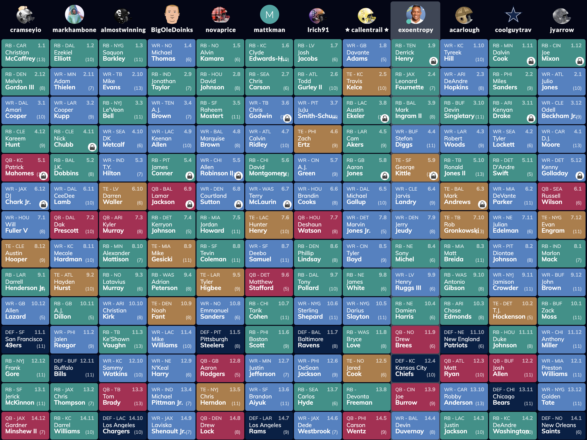

## Draft Board

##  Manhattan (KS) Miracles | 0-0W/L | 0PF

I think this team has the potential to dominate with the potent core of Christian McCaffrey and Patrick Mahomes. I'm so proud of Lil' Flutie for finally realizing that you should draft a running back before the late fourth round. Melvin Gordon will have an average YPC and dominate carries as a strong RB2. Amari Cooper is a quality WR1, and I dig the DJ Chark pick too. Allen Lazard was reliable in college and could be a great sleeper. The 49ers D/ST has the potential to rack up the points with how deep the defensive line is. This is the team to beat this year.

##  Bijan Mustard | 0-0W/L | 0PF

I know this is super biased, but come on. Assuming that JK Dobbins doesn't cut into Mark Ingram's production too much, this is the best running back corps in the entire league. Derrick Henry and Leonard Fournette should both eat well in their respective offenses as RB1 and RB2. I'll very likely play two RBs as in the flex spot. Assuming that Damien Harris controls the backfield as planned, having another RB1-caliber player could be the difference-maker. George Kittle should finish as a top tight end. Drew Brees is reliable at quarterback. Wide receiver is the most significant question mark, but if a rookie pick like Jerry Jeudy or Henry Ruggs III pays off, I'll have a complete team.

##  markhambone | 0-0W/L | 0PF

This might be the most well-rounded team with just the right amount of spicy potential. Ezekiel Elliot and Nick Chubb are a reliable one-two punch at running back. If Cooper Kupp stays healthy, the wide receiver corps can be lethal with Adam Thielen. CeeDee Lamb, AJ Dillon, and JK Dobbins are great picks with disruptive potential. I think the success of Mark's team depends on these three. A classic Mark schadenfreude draft.

##  BigOleDoinks | 0-0W/L | 0PF

Carl drafted very well per usual. I think Lamar Jackson should finish as the second-best quarterback behind Patrick Mahomes. Keeping him in the sixth freed him up to pick what might be the second strongest receiver corps in the league. James Conner should continue to be the lynchpin of this team, and if Jonathan Taylor delivers, this team should be a playoff contender. My only concern with his team is the depth behind quality starters.

##  Glizzy Guzzlers | 0-0W/L | 0PF

The running backs are my biggest concern with Callen's team. Austin Ekeler was a great keeper, but Cam Akers is unknown at this point. He will control the carries, but who knows how he'll perform. Aaron Jones is at risk of the AJ Dillon hype. The wide receivers look pretty reliable even though the only name that jumps off the page is Davante Adams. I'm sure Callen did all the research to pick dudes who will have an excellent point median.

## K(icker) Man | 0-0W/L | 0PF

I'm a Clyde Edwards-Helaire truther. I think he's the most likely number two fantasy running back behind McCaffrey. Chris Carson is a solid RB2, but the rest make me nervous. I think David Montgomery should be startable based on opportunity alone, but we still haven't seen the performance from him yet. K-Man has a top-notch group of receivers that will carry him far. I don't understand the Matthew Stafford pick unless he's part of a Lions fan sleeper cell.

## almostwinning | 0-0W/L | 0PF

I think Trond should just auto-draft every year. The league was kind enough to give him a very well-balanced team with just the right potential. Saquon Barkley and Le'Veon Bell form a quality running back corps. Mike Evans, DK Metcalf, and TY Hilton form a strong group of receivers. Kyler Murray and Darren Waller are high-upside players. Why did we do this again?

##  🏆‼️ | 0-0W/L | 0PF

At a glance, the reigning champion's team has the highest probability for bust. Dalvin Cook is a solid rock of an RB1, but Tarv got into bed with some of the worst teams. I'm not on the Kenyan Drake hype train, but maybe the Dolphins genuinely are that bad at using talent. Miles Sanders' ADP seemed way too high for being an Eagles running back. D'Andre Swift is an unknown commodity and even worse plays for the Lions. DeVante Parker was the right choice for the draft spot, but he still plays for the Dolphins. I'm not stoked about the Josh Allen pick other than he'll probably run for some touchdowns. However, this team does have a compelling group of mid-level receivers with potential.

## Court is in Sutton | 0-0W/L | 0PF

I feel pretty lukewarm about Caleb's team. I think there's upside with decent risk. This team's success hinges on David Johnson delivering at least 70% of his previous high-level performance. Trying to guess San Francisco's backfield could lead to some significant headaches and points left on the bench. Caleb has a pretty strong group of receivers, and Drew Lock could be a quality flier pick. I expect this to be a middle of the road team.

## lrich91 | 0-0W/L | 0PF

I could be very wrong about Logan's team, but I see a lot of risks right now. Josh Jacobs should be reliable at RB1 again, but I'd be shocked to see Todd Gurley perform at his elite level of previous seasons. JuJu Smith-Schuster and Zach Ertz were great picks, but AJ Green and Brandin Cooks have significant health concerns. Deshaun Watson could be this team's lynchpin, and Logz drafted very well in the later rounds with Phillip Lindsey, Sterling Shepard, and the Ravens D/ST.

## CDC Lamb | 0-0W/L | 0PF

This is the worst draft I've ever seen from Carlos. Unless he pulls off some shady used car salesman trades to fix his running back situation, I think his ceiling is fighting for one of the last playoff spots. Devin Singletary and Ronald Jones inspire little confidence as RB1 and RB2. However, he should have the best group of wide receivers with Tyreek Hill, DeAndre Hopkins, and Robert Woods. Keep your eyes peeled for him to shop off Rob Gronkowski at an exorbitant premium. I can't think of any other reason why he would have taken two tight ends as he did.

##  jyarrow | 0-0W/L | 0PF

This team has the worst running back situation by far. Keeping Joe Mixon was a great move, but John waited far too long to take another back. Marlon Mack and Zack Moss will likely take backup snaps, far from ideal as an RB2. Julio Jones and Odell Beckham Jr. are names that I would have been excited about in past seasons, but I'm not too high on now. Russell Wilson will probably work some magic for him per usual, but I think John drafted him too early in the sixth round. I see more potential than production on this team.
